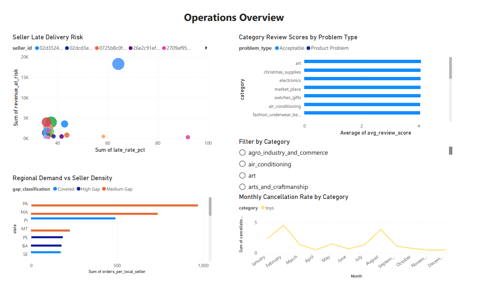
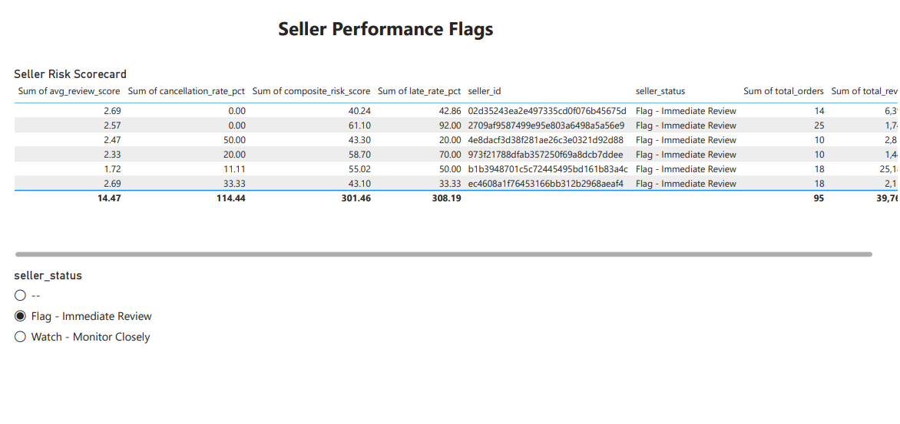

# Olist E-Commerce Operations Dashboard

A seller and operations intelligence dashboard built on the [Olist Brazilian E-Commerce dataset](https://www.kaggle.com/datasets/olistbr/brazilian-ecommerce).

## Stack
- Python, Pandas, SQLAlchemy
- PostgreSQL
- Power BI

## Business Questions Answered

1. **Seller Late Delivery Risk** — Which sellers have the highest late delivery rate and revenue at risk?
2. **Category Review Analysis** — Which product categories have worst review scores — product or logistics problem?
3. **Regional Demand Gaps** — Which regions have high demand but low seller density?
4. **Cancellation Trends** — Month-over-month cancellation trends by category
5. **Composite Seller Score** — Who should be flagged for immediate review?

## Project Structure
olist-dashboard/
├── data/          # Raw CSVs (not tracked)
├── sql/           # SQL queries for each business question
├── src/           # Python scripts for ingestion and export
├── output/        # Exported CSVs for Power BI
└── powerbi/       # Power BI dashboard file

## Dashboard Preview

## Setup
1. Download Olist dataset from Kaggle
2. Create a PostgreSQL database named `olist`
3. Configure `.env` with your DB credentials
4. Run `python src/ingest.py` to load data
5. Run `python src/export.py` to generate Power BI source files
6. Open `powerbi/olist_dashboard.pbix` in Power BI Desktop